# 🗄️ MongoDB Setup: In-Memory vs Docker

This project supports two MongoDB configurations:

## 1) In-Memory MongoDB (Flapdoodle)
- **Dependency:** [de.flapdoodle.embed.mongo.spring30x](https://github.com/flapdoodle-oss/de.flapdoodle.embed.mongo) (see `pom.xml`).
- **Purpose:** Mainly used for **tests** and quick development slices (`@DataMongoTest`).
- **Note:** In `application.yaml` the embedded auto-configuration is **disabled**:
  ```yaml
  spring:
    autoconfigure:
      exclude:
        - de.flapdoodle.embed.mongo.spring.autoconfigure.EmbeddedMongoAutoConfiguration
  spring:
    data:
      mongodb:
        uri: mongodb://localhost:27017/testdb
  ```
  That means the **running application** connects to an **external MongoDB**, not the embedded one.  
  If you prefer to run the app with embedded Mongo, remove the `exclude` entry and clear the `spring.data.mongodb.uri`.

## 2) Docker MongoDB (recommended for running the app)
- **Why:** A real MongoDB instance makes it easy to inspect the **read model projections** with a graphical client.
- **Compose file:** `src/main/resources/docker-compose.yml`
- **Start it:**
  ```bash
  docker compose -f src/main/resources/docker-compose.yml up -d
  ```
- **Connection string (from `application.yaml`):**
  ```
  mongodb://localhost:27017/testdb
  ```

### GUI Options
- **Mongo Express** (if included in the Compose setup):  
  Open [http://localhost:8081](http://localhost:8081) in your browser.
- **MongoDB Compass** (desktop app):  
  Use the connection string:
  ```
  mongodb://localhost:27017/testdb
  ```

## Quick Run
```bash
# 1) Start external MongoDB
docker compose -f src/main/resources/docker-compose.yml up -d

# 2) Run the Spring Boot app
mvn spring-boot:run
```

---

**Summary:**
- **Embedded Mongo (Flapdoodle):** included in the project, mostly for tests; disabled for the main app by default.
- **Docker Mongo:** used by the application at runtime, supports GUI tools like Mongo Express or Compass for easy inspection.

---


## Sequence Diagram: Reservation Notification Flow

```plantuml
@startuml
hide footbox

box "Write database" #LightBlue
    participant "SaveReservationPersistenceAdapter" as SaveReservationPersistenceAdapter
    participant "ReservationJpaRepository" as ReservationJpaRepository
    participant "ReservationPersistedEvent" as ReservationPersistedEvent
end box

participant "ApplicationEventPublisher" as ApplicationEventPublisher

box "Projector" #LightGreen
    participant "ReservationPersistedEventListener" as ReservationPersistedEventListener
    participant "ReservationProjectorService" as ReservationProjectorService
    participant "ReservationWriteModelLoader" as ReservationWriteModelLoader
    participant "RoomWriteModelLoader" as RoomWriteModelLoader
    participant "ReservationProjectionMapper" as ReservationProjectionMapper
    participant "ReservationReadModelUpserter" as ReservationReadModelUpserter <<Interface>>
end box

box "Read database" #LightYellow
    participant "ReservationReadModelUpserterMongo" as ReservationReadModelUpserterMongo
    participant "ReservationMongoRepository" as ReservationMongoRepository
end box

activate ApplicationEventPublisher

-> SaveReservationPersistenceAdapter : saveReservation(r: Reservation)
activate SaveReservationPersistenceAdapter
SaveReservationPersistenceAdapter -> ReservationJpaRepository : save(jpaEntity)
SaveReservationPersistenceAdapter -> ReservationPersistedEvent ** : create
SaveReservationPersistenceAdapter -> ApplicationEventPublisher : publishEvent(event)
deactivate SaveReservationPersistenceAdapter


activate ReservationPersistedEventListener
ApplicationEventPublisher --> ReservationPersistedEventListener : @TransactionalEventListener
ReservationPersistedEventListener -> ReservationProjectorService : on(event)
deactivate ReservationPersistedEventListener

activate ReservationProjectorService
ReservationProjectorService -> ReservationWriteModelLoader : load(event.reservationId): ReservationSnapshot
ReservationProjectorService -> RoomWriteModelLoader : load(event.roomId): RoomSnapshot
ReservationProjectorService -> ReservationProjectionMapper : toReadModel(reservation, room, event) : ReservationProjectionView
ReservationProjectorService -> ReservationReadModelUpserter : upsert(mongoDoc)
deactivate ReservationProjectorService

ReservationReadModelUpserter --> ReservationReadModelUpserterMongo : (calls implementation)
ReservationReadModelUpserterMongo -> ReservationMongoRepository : save(mongoDoc)
@enduml


```

<details>
<summary>Click to expand PlantUML diagram</summary>


</details> 
