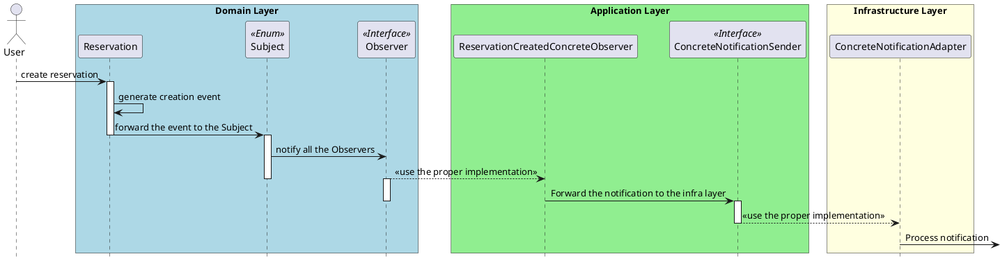

## Sequence Diagram: Reservation Notification Flow

Click to expand PlantUML diagram

```plantuml
@startuml
hide footbox
actor User
box "Domain Layer" #LightBlue
    participant "Reservation" as Reservation
    participant "Subject" as Publisher <<Enum>>
    participant "Observer" as Observer <<Interface>>
end box

box "Application Layer" #LightGreen
    participant "ReservationCreatedConcreteObserver" as ConcreteObserver
    participant "ConcreteNotificationSender" as Port <<Interface>>
end box

box "Infrastructure Layer" #LightYellow
    participant "ConcreteNotificationAdapter" as Adapter
end box

User -> Reservation : create reservation
activate Reservation
Reservation -> Reservation : generate creation event
Reservation -> Publisher : forward the event to the Subject
deactivate Reservation

activate Publisher
Publisher -> Observer : notify all the Observers
Observer --> ConcreteObserver : <<use the proper implementation>>
deactivate Publisher

activate Observer
ConcreteObserver -> Port : Forward the notification to the infra layer
deactivate Observer

activate Port
Port --> Adapter : <<use the proper implementation>>
deactivate Port
Adapter ->] : Process notification
@enduml
```

 